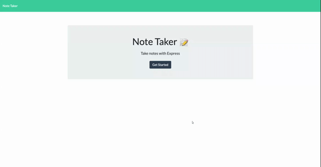

# Notes Taker
Notes taker is a web application to create, save and delete notes. This full stack application built using express.js in the backend and hosted on Heroku. 

# Tech Stack
- HTML
- CSS 
- Express.js
- Heroku 
- npm Packages

# License 
Licensed under the MIT license!

# Application Details 
GH Repo @ https://github.com/rajeswarivmarimuthu/notes-taker  
Application Deployed @ https://notes-recorder.herokuapp.com/notes 

# Demo
